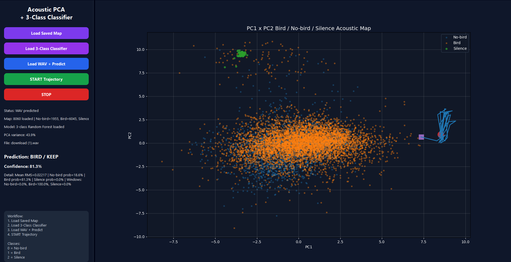

# Acoustic PCA 3-Class Classifier



**Figure 1. Acoustic PCA 3-Class Classifier GUI.**  
This prototype visualises uploaded WAV audio in a PCA feature space and classifies the recording into three classes: **Bird**, **No-bird**, and **Silence**.

The green points represent silence samples, orange points represent bird samples, and blue points represent no-bird/background samples.  
When a WAV file is uploaded, the system extracts acoustic features, projects the windows onto the PCA map, and uses a trained Random Forest classifier to produce a prediction and confidence score.

In the example above, the uploaded file was classified as:

```text
Prediction: BIRD / KEEP
Confidence: 81.3%
