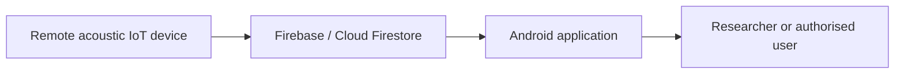

# Bioacoustics IoT Android Application

An Android research application for remotely monitoring acoustic Internet of Things (IoT) devices and presenting their data to users through Firebase.

This application is part of the **Bioacoustics of IoT** research project. Remote field devices collect device and acoustic-monitoring data and send it to Firebase. The Android application retrieves the available records and presents them through a mobile interface, allowing a researcher or authorised user to observe deployed devices without being physically present at each site.

## Purpose

The application is intended to provide a mobile interface between remote acoustic IoT devices and users. Its main responsibilities are:

- displaying registered field devices;
- monitoring device availability and the most recently reported status;
- retrieving device and acoustic-monitoring data from Firebase;
- presenting the retrieved information in a user-friendly form;
- supporting remote observation of geographically distributed deployments; and
- providing an experimental platform for bioacoustics and IoT research.

The application is a **research prototype**. It should be validated and secured appropriately before being used as a production monitoring system.

## System Architecture



### Data flow

1. A remote IoT device captures or generates monitoring information.
2. The device sends the available information to Firebase.
3. Firebase stores the device and observation records.
4. The Android application reads the permitted records.
5. The application presents the information to the user for remote monitoring.

The exact fields available to the application depend on the deployed device firmware and the configured Firestore schema.

## Core Features

- Remote monitoring of acoustic IoT devices
- Firebase-backed data synchronisation
- Retrieval of device and observation information
- Mobile presentation of the latest available records
- Support for research-oriented bioacoustic deployments
- Extensible structure for additional devices, measurements, and visualisations

## Technology Stack

- **Platform:** Android
- **Build system:** Gradle with Kotlin DSL
- **Backend:** Firebase
- **Database:** Cloud Firestore
- **Development environment:** Android Studio

## Repository Structure

```text
Android_Acoustic_App/
├── app/                              # Android application module
├── gradle/                           # Gradle wrapper and version catalogue
├── FIRESTORE_MAP_SCHEMA_DRAFT.md     # Draft Firestore map/data schema
├── FIRESTORE_RULES_MAP_DRAFT.txt     # Draft Firestore security rules
├── FIRESTORE_TODO_LIST.md            # Firebase and Firestore implementation tasks
├── build.gradle.kts                  # Project-level build configuration
├── settings.gradle.kts               # Gradle project settings
├── gradle.properties                 # Gradle configuration
├── gradlew                           # Gradle wrapper for Linux/macOS
└── gradlew.bat                       # Gradle wrapper for Windows
```

Generated build directories, local IDE settings, and machine-specific configuration files are excluded from version control.

## Requirements

Before building the application, install or obtain:

- a current Android Studio installation;
- the Android SDK versions required by the project;
- the JDK version required by the configured Android Gradle Plugin;
- access to an authorised Firebase project; and
- a Firebase Android configuration file for that project.

## Firebase Configuration

1. Create or select the appropriate project in the Firebase console.
2. Register the Android application with that Firebase project.
3. Download the Firebase Android configuration file.
4. Place the configuration file at:

   ```text
   app/google-services.json
   ```

5. Configure the required Cloud Firestore collections, indexes, and security rules.
6. Review the following project documents before deploying the backend:

   - `FIRESTORE_MAP_SCHEMA_DRAFT.md`
   - `FIRESTORE_RULES_MAP_DRAFT.txt`
   - `FIRESTORE_TODO_LIST.md`

Do not commit Firebase Admin SDK credentials, service-account private keys, signing keys, passwords, or other secrets to this repository.

## Build and Run

Clone the repository:

```bash
git clone https://github.com/botir2/Bioacustics_of_IoT.git
cd Bioacustics_of_IoT/Android_Acoustic_App
```

Then:

1. Open `Android_Acoustic_App` in Android Studio.
2. Add the authorised Firebase configuration.
3. Allow Gradle to synchronise the project.
4. Select an Android emulator or connected physical device.
5. Run the `app` configuration.

On Windows, a command-line build can also be started with:

```powershell
.\gradlew.bat assembleDebug
```

On Linux or macOS:

```bash
./gradlew assembleDebug
```

## Security and Privacy

Bioacoustic deployments may contain sensitive information, including device locations, timestamps, environmental observations, and recorded or derived acoustic data. Deployments should therefore:

- apply least-privilege Firestore security rules;
- require appropriate user authentication and authorisation;
- restrict write access to trusted devices or backend services;
- avoid embedding private credentials in the Android application;
- protect sensitive location and observation data; and
- define an appropriate data-retention policy.

The draft security rules included in this project must be reviewed and tested before production use.

## Current Status

This application is under active development as part of a bioacoustics and IoT research workflow. Features, data models, Firebase rules, and user-interface components may change as the experimental system develops.

## Maintainer

**Botirjon Karimov**  
PhD research in bioacoustics, IoT, and edge computing

