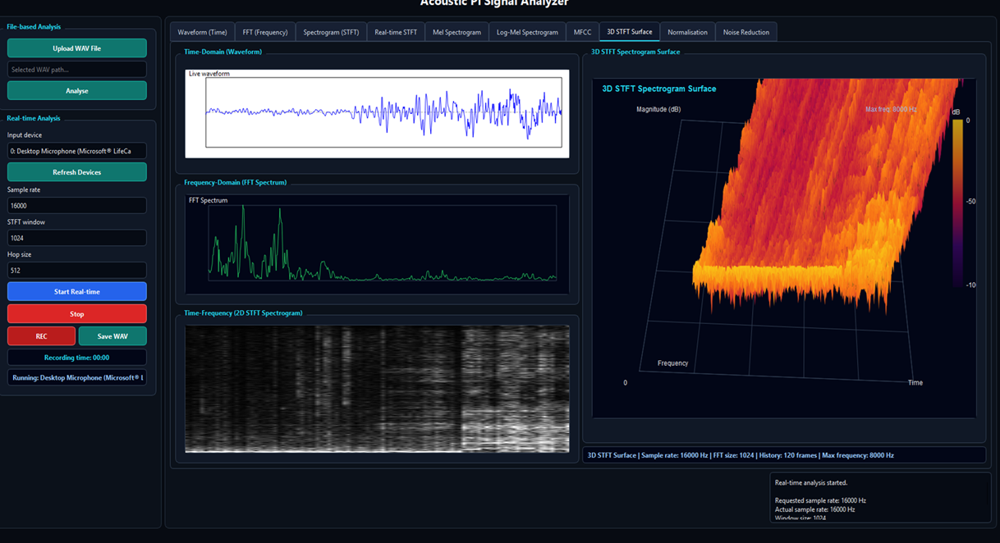
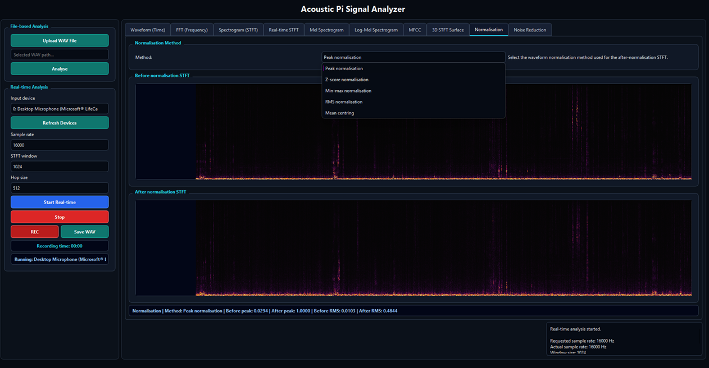
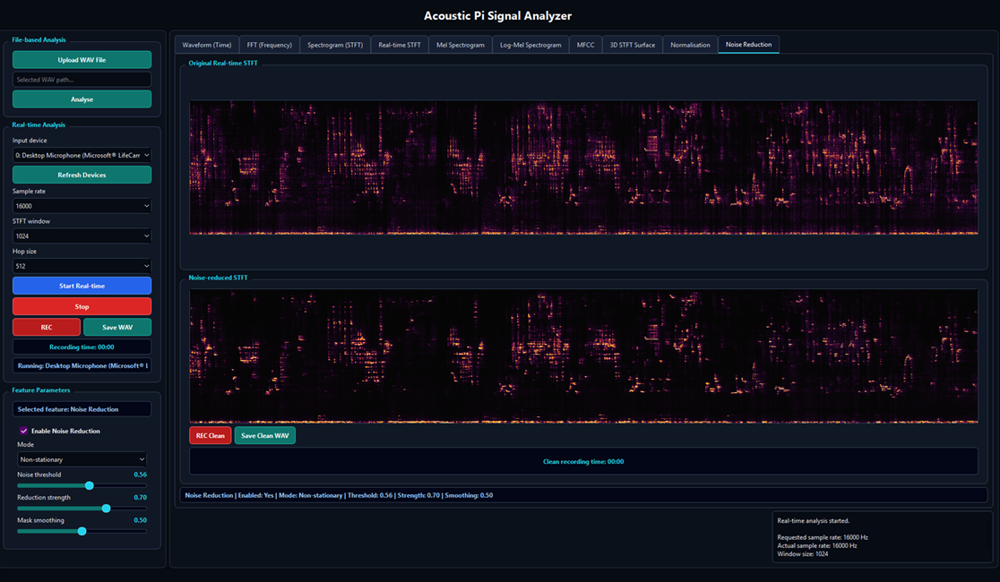

# PiAudioAnalyzer

**PiAudioAnalyzer** is a Qt C++ acoustic signal analysis prototype for file-based and real-time microphone input. It is designed as a practical visual tool for ecoacoustic and IoT audio-processing experiments, especially for testing waveform, frequency-domain, spectrogram, normalisation, and noise-reduction behaviour before moving selected processing steps to a low-power device such as a Raspberry Pi.

## Purpose

The project demonstrates how a desktop/embedded Qt application can support acoustic pre-processing experiments for IoT bioacoustic monitoring. The GUI allows a user to load WAV files, analyse live microphone input, view multiple audio representations, compare normalisation methods, and test noise-reduction settings.

## Main features

- WAV file upload and analysis.
- Real-time microphone input using Qt Multimedia.
- Time-domain waveform display.
- FFT frequency spectrum display.
- STFT spectrogram display.
- Real-time STFT view.
- Mel spectrogram and log-Mel spectrogram views.
- MFCC feature display.
- 3D-style STFT surface visualisation.
- Waveform normalisation comparison.
- Noise-reduction comparison between original and processed STFT outputs.
- Recording of raw audio and optional clean/noise-reduced audio.

## Screenshots

### 1. Real-time acoustic analysis dashboard



This view shows the main real-time analysis interface. The left panel contains file-based and real-time controls, including WAV upload, microphone device selection, sample-rate configuration, STFT window settings, and recording controls. The central and right panels show the waveform, FFT spectrum, STFT spectrogram, and a 3D-style STFT surface. This view is useful for observing how live audio changes across time, frequency, and spectrogram representations.

### 2. Normalisation comparison view



This view compares the STFT representation before and after waveform normalisation. The method selector includes peak normalisation, Z-score normalisation, min-max normalisation, RMS normalisation, and mean centring. This part of the prototype supports testing how different normalisation methods affect the acoustic signal representation before downstream detection or classification.

### 3. Noise-reduction comparison view



This view compares the original real-time STFT with the noise-reduced STFT. The interface includes controls for enabling noise reduction, choosing stationary or non-stationary mode, and adjusting threshold, reduction strength, and smoothing. It also includes clean recording controls, which allow the user to save a processed version of the incoming audio.

## Project structure

```text
PiAudioAnalyzer/
├── CMakeLists.txt
├── main.cpp
├── mainwindow.cpp / mainwindow.h / mainwindow.ui
├── audioprocessor.*
├── realtimeaudiocontroller.*
├── ffthelper.*
├── stftprocessor.*
├── realtimeplotrenderer.*
├── featuremaprenderer.*
├── melfeatureprocessor.*
├── melfilterbank.*
├── melbank.*
├── melspec.*
├── logmel.*
├── mfccprocessor.*
├── realtimefeaturehelper.*
├── surface3drenderer.*
├── stftnoisereducer.*
├── normalizer.*
├── noisereducer.*
└── screenshots/
```

## Requirements

- Qt 6.5 or later
- Qt Widgets
- Qt Multimedia
- CMake 3.19 or later
- A C++17-compatible compiler

## Build instructions

### Option 1: Qt Creator

1. Open Qt Creator.
2. Select **Open Project**.
3. Open `CMakeLists.txt` from this folder.
4. Configure the Qt kit.
5. Build and run the project.

### Option 2: Command line

```bash
cd PiAudioAnalyzer
cmake -S . -B build
cmake --build build
```

Run the application from the generated build folder.

## Notes

This prototype is intended for experimental evaluation and visual inspection of acoustic pre-processing behaviour. It is not yet a final embedded deployment package. The next development step can be to connect selected processing blocks to a Raspberry Pi workflow and measure latency, CPU/RAM use, and energy cost during live operation.
